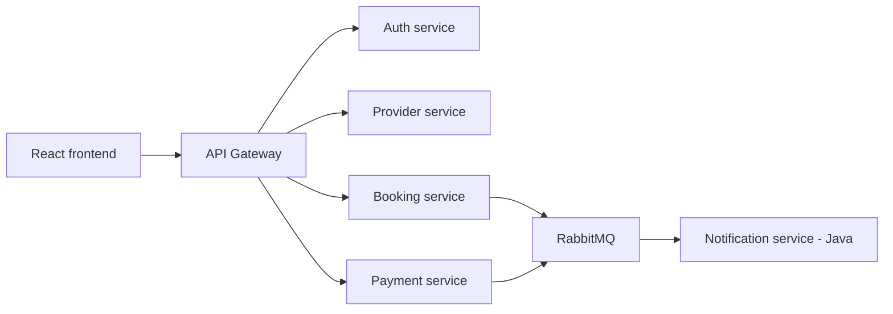

# Arhitektura sistema

Početni tok zahteva:

Svaki servis je vlasnik svojih podataka. Direktan pristup bazi drugog servisa nije
dozvoljen. Sinhroni pozivi koriste HTTP/REST, a događaji koji ne zahtevaju trenutni
odgovor razmenjuju se preko RabbitMQ-a.

Booking servis je centralni primer za canary rollout (ažurirano — ranija verzija
ovog odeljka je opisivala plan pre implementacije; stvarna v1/v2 razlika je
drugačija, vidi `docs/docker-i-v2-izvestaj.md` za detalje):

- `v1` — kreiranje/otkazivanje rezervacije, provera preklapanja termina i
  penal za kasno otkazivanje (ovo je zajedničko obema verzijama, nije razlika
  među njima);
- `v2` — dodatno, sinhrono proverava kod provider-service-a da provajder i
  usluga iz zahteva postoje, da su aktivni i da usluga pripada tom provajderu,
  PRE potvrde rezervacije (`ProviderServiceClient`) — v1 ovo namerno ne radi;
- obe verzije taguju odgovor `X-Booking-Service-Version` header-om;
- Prometheus metrike (booking-service `/actuator/prometheus`, planirano —
  vidi `docs/k8s-argo-rollouts-plan.md`) služe Argo Rollouts analizi;
- neuspešna analiza automatski prekida promociju i vraća saobraćaj na stabilnu verziju.

