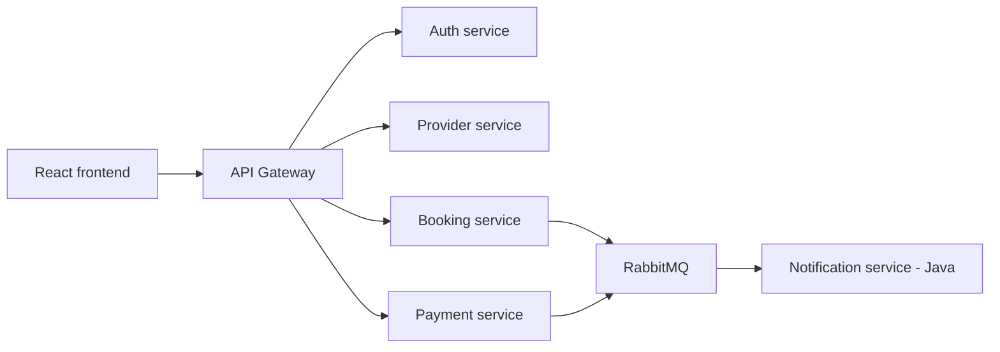

# Arhitektura sistema

Početni tok zahteva:

Svaki servis je vlasnik svojih podataka. Direktan pristup bazi drugog servisa nije
dozvoljen. Sinhroni pozivi koriste HTTP/REST, a događaji koji ne zahtevaju trenutni
odgovor razmenjuju se preko RabbitMQ-a.

Booking servis je centralni primer za canary rollout:

- `v1` — osnovno kreiranje i otkazivanje rezervacije;
- `v2` — provera preklapanja termina i pravilo kasnog otkazivanja;
- Prometheus metrike služe Argo Rollouts analizi;
- neuspešna analiza automatski prekida promociju i vraća saobraćaj na stabilnu verziju.

